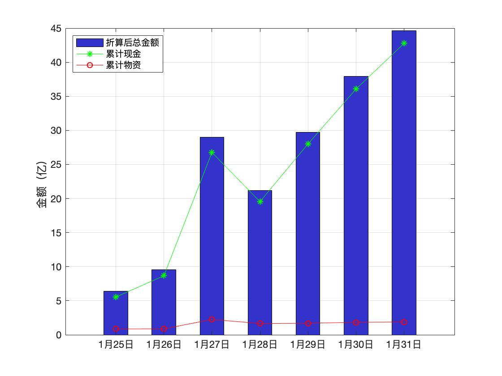

[项目贡献](./CONTRIBUTE)
[免责声明](#免责声明)
[疫情导航](http://nav.werty.cn/)
[武汉2020](https://wuhan2020.github.io/zh-cn/index.html)
[联系我们](https://weileizeng.com/news/1992/06/29/contact/)

本站旨在收集湖北/武汉红十字的相关公示信息，集中展示，为大家做参考。同时我们对舆论节点做一个时间轴整理。

### [湖北省红十字会](http://hbsredcross.org.cn/)累计捐赠曲线图

注：为什么27号这么高？这还是累计数据吗？笔者作为数据搬运工无法解释，读者可参考下表链接自行考证。

### [湖北省红十字会](http://hbsredcross.org.cn/)累计捐赠情况

|编号| 日期 |累计捐款 万元|累计物资 万元|合计 万元|                         链接                         |
|---:|------|------------:|------------:|--------:|------------------------------------------------------|
|   7|31-Jan|      42767.3|       1876.2|  44643.5|[link](http://www.hbsredcross.org.cn/xxgk/10063.jhtml)|
|   6|30-Jan|      36069.3|       1836.2|  37905.5|[link](http://www.hbsredcross.org.cn/xxgk/4858.jhtml) |
|   5|29-Jan|      28017.1|       1699.5|  29716.6|[link](http://www.hbsredcross.org.cn/xxgk/4629.jhtml) |
|   4|28-Jan|      19549.8|       1663.5|  21213.3|[link](http://www.hbsredcross.org.cn/xxgk/4628.jhtml) |
|   3|27-Jan|      26764.5|       2248.7|  29013.1|[link](http://www.hbsredcross.org.cn/xxgk/4417.jhtml) |
|   2|26-Jan|       8673.8|        875.4|   9549.2|[link](http://www.hbsredcross.org.cn/xxgk/4393.jhtml) |
|   1|25-Jan|       5541.4|        856.3|   6397.7|[link](http://www.hbsredcross.org.cn/xxgk/4292.jhtml) |

### [1月30日公布物资使用情况](http://www.hbsredcross.org.cn/xxgk/4704.jhtml)

|             捐赠方             |                   物资                    |折算金额(万元)|               流向                |                                      链接                                       |
|--------------------------------|-------------------------------------------|-------------:|-----------------------------------|---------------------------------------------------------------------------------|
|河北以岭药业有限公司            |莲花清瘟胶囊（24粒装）13.5万盒             |        500.00|省疾控中心                         |[link](https://www.rfa.org/mandarin/yataibaodao/huanjing/ql2-01312020071453.html)|
|上海宇昂科技王宇董事长          |聚维酮碘消毒液1400瓶60箱                   |          4.90|省疾控中心                         |                                                                                 |
|杭州占戈贸易有限公司            |口罩（N95型、一次性口罩）5万只             |          7.00|省疾控中心                         |                                                                                 |
| 江苏新农科技有限公司           |口罩（KN95型1200盒、银离子口罩2万只、一    |         76.00|省疾控中心                         |                                                                                 |
|湖北稳健集团                    |医用口罩5万只、消毒液1000瓶                |          3.46|武汉铁路局                         |                                                                                 |
|中国科学院王中林院士            |N95型口罩1万只                             |         20.00|省疾控中心                         |                                                                                 |
|安徽惟北大鱼环保科技有限公司    |壁挂式离子木智能空气消毒仪10台             |          5.00|武汉火车站 武昌火车站 汉口火车站   |                                                                                 |
|黑龙江红十字会                  |双黄连口服液                               |        110.00|省疾控中心                         |                                                                                 |
|河南省红十字会                  |捐赠口罩、抗菌床品、白大衣、护士服等用品   |         14.93|孝感市疾控中心                     |                                                                                 |
|江西华强医疗器械有限公司        |口罩3万个                                  |          4.50|荣军医院                           |                                                                                 |
|陕西韩女士                      |口罩3000个                                 |          1.20|协和医院                           |                                                                                 |
|刘芳菲                          |硒茶粉25袋                                 |              |武汉市天佑医院                     |                                                                                 |
|天津市红十字会                  |静注人免疫球蛋白（PH4）150瓶、盐酸阿比多胶 |         20.11|荣军医院                           |                                                                                 |
|北京森根比亚生物工程技术有限公司|N95口罩36000个                             |         36.00|武汉仁爱医院1.6 武汉天佑医院1.6万  |                                                                                 |
|倪忠华                          |护目镜144个                                |          0.36|徐家棚社区72个 上海中医医院医疗队72|                                                                                 |
|涿州华诺救生装备有限公司        |护目镜98个，医用橡胶手套198副，酒精消毒棉片|          2.30|华中科技大学校医院                 |                                                                                 |
|苏州宝集沣生物科技有限公司      |拜欧海多汀1500支                           |         56.70|武汉市天佑医院                     |                                                                                 |

### 部分官方网站链接
* [湖北省红十字会](http://hbsredcross.org.cn/)

### 红十字新闻大事件 （仅收集热点事件，不代表本站观点）

* [寿光蔬菜事件](http://www.nbd.com.cn/articles/2020-01-30/1403811.html)
* 2月1日 [鄂A0260W为领导提口罩](https://mp.weixin.qq.com/s/ts4v6aSPrL26DVt6dm63-A)
* 2月1日 [央视直播被中断](https://mp.weixin.qq.com/s/z4cBGt6By1g39UP2g-z3ug)

 

 <h3> 免责声明 </h3> 

本站不生产任何数据，仅供参考。所有数据来源于官方发布和新闻报道，我们仅提供链接，请各位自行查证。
统计方法可能有偏颇遗漏，欢迎指正。

How to contribute? open an issue in [github](https://github.com/WeileiZeng/red-cross)

截止Feb 2, 11:45AM
已有
{{ site.visitor_count }}
名云监工来过