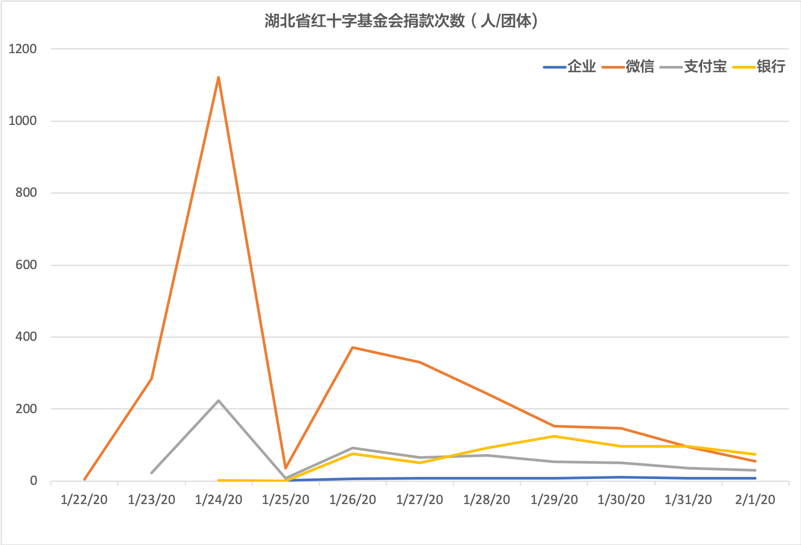
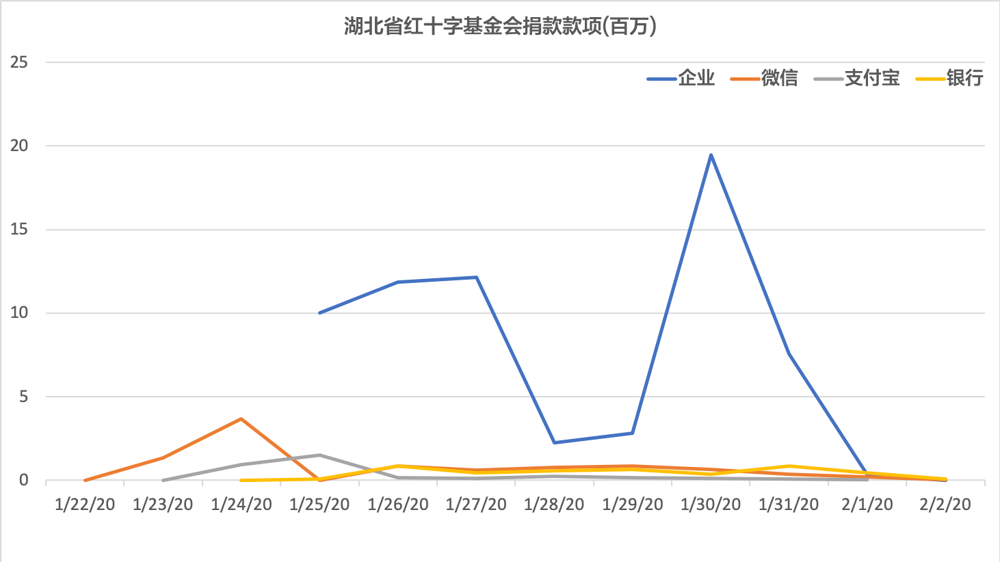



### 湖北省红十字会累计捐赠曲线图

截止2月6日，官网未有捐款数据更新。

<!-- ### 湖北省红十字会累计捐赠表 { % include hubei-donation.md %} -->

### 湖北省红十字会社会捐款*次数

社会捐款（企业和个人）人次明显减少

### 湖北省红十字基金会社会捐款*款项

社会捐款大部分来源于企业捐款，数额也大幅减少。

 \* 注：社会捐款不包括政府机构拨款（比如国家拨款，其他红十字会赞助等）。政府拨款才是红十字会的主要资金来源。

### [1月30日公布物资使用情况](http://www.hbsredcross.org.cn/xxgk/4704.jhtml)

<iframe src="https://azurini.github.io/HB_wz_fafang_1.html" width="100%" height="420"></iframe>

<iframe src="https://azurini.github.io/HB_wz_laiyuan.html" width="100%" height="500"></iframe>

#### 1月31日物资发放明细



注：“N95口罩36000个”更正为“KN95口罩36000个”，其流向“武汉仁爱医院1.6万、武汉天佑医院1.6万”更正为“武汉仁爱医院1.8万个、武汉天佑医院1.8万个”  [link](http://www.hbsredcross.org.cn/xxgk/8667.jhtml)




