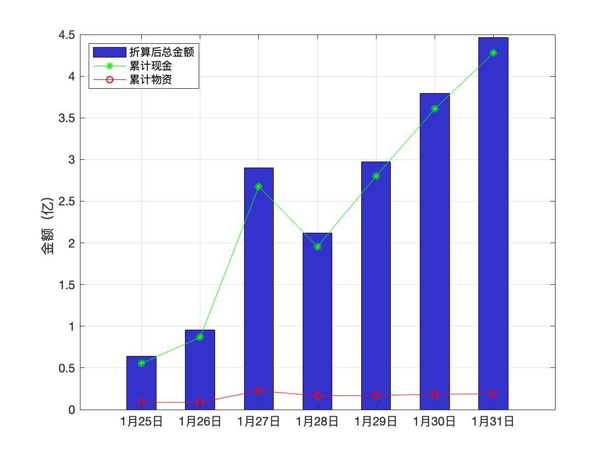
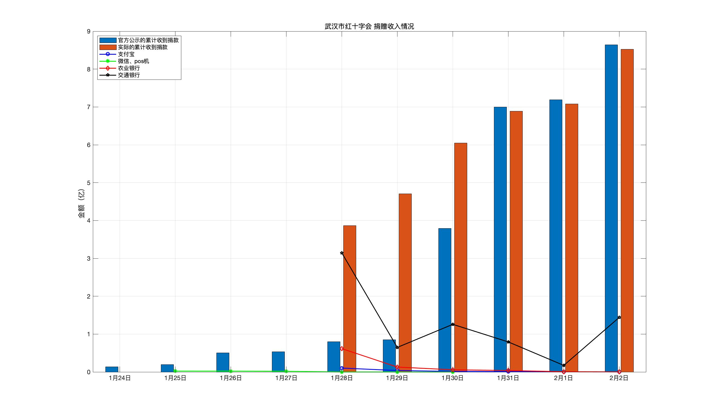



<!--本站旨在收集湖北/武汉红十字的相关公示信息，集中展示，为大家做参考。同时我们对舆论节点做一个[时间轴](#时间轴)整理。-->

### 官网公示数据概览
截止1月31日，湖北省红十字会累计收到 捐款和物资4.46亿元。共发放862万元物资（30日）。

截止2月4日，武汉市红十字会累计收到捐款9.84亿，共拨款5.52亿

注：官网公示数据不代表实际数据（有些未公布），但是可以反应出信息透明度。

### [湖北省红十字会](http://hbsredcross.org.cn/)累计捐赠曲线图

以上是湖北省红十字会累计捐款数目。为什么27号这么高？这还是累计数据吗？难道28号的捐款是负数？
这么简单的错误，只是红十字官网数据不合理之处的九牛一毛。本站对官网数据的摸索途中，发现了无数个瓜。。
[去给湖北红十字会监工](./hubei)

### 武汉市红十字会捐赠收入

<!--  -->

官网每日发布总额与官网每日发布明细之总额做对比。
其中，1月28至30日明细统计远高于官网公布总额

### 武汉红十字会--收支情况

[去给武汉红十字监工](./wuhan)

<!-- [查看统计数据](raw_data/summary/武汉红十字会捐款收支情况2.xlsx) -->




