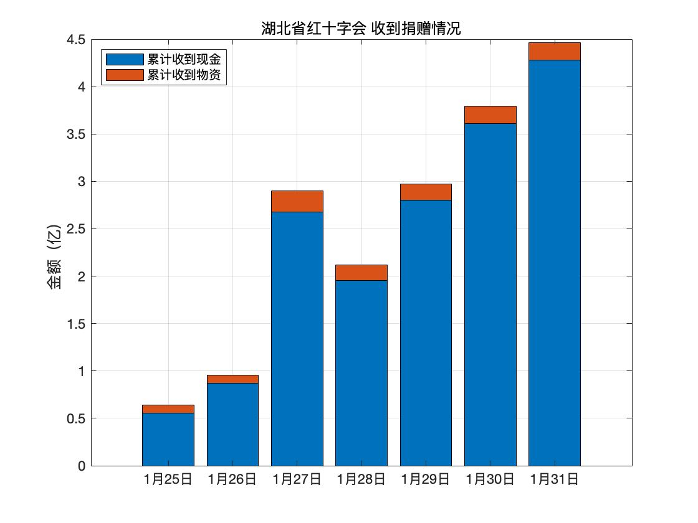



本站旨在收集湖北/武汉红十字的相关公示信息，集中展示，为大家做参考。同时我们对舆论节点做一个[时间轴](#时间轴)整理。

### 官网公示数据概览
截止1月31日，湖北省红十字会累计收到 捐款和物资4.46亿元。共发放862万元物资（30日）。

截止1月2日，武汉市红十字会累计收到捐款7.19亿，共拨款3.62亿（28，30，31号拨款总额）

注：官网公示数据不代表实际数据（有些未公布），但是可以反应出信息透明度。

### [湖北省红十字会](http://hbsredcross.org.cn/)累计捐赠曲线图

为什么27号这么高？这还是累计数据吗？请湖北红十字会解释！

### 武汉市红十字会捐赠收入

官网每日发布总额与官网每日发布明细之总额做对比。
其中，1月28至30日明细统计远高于官网公布总额

[查看统计数据](raw_data/summary/武汉红十字会捐款收支情况2.xlsx) 




