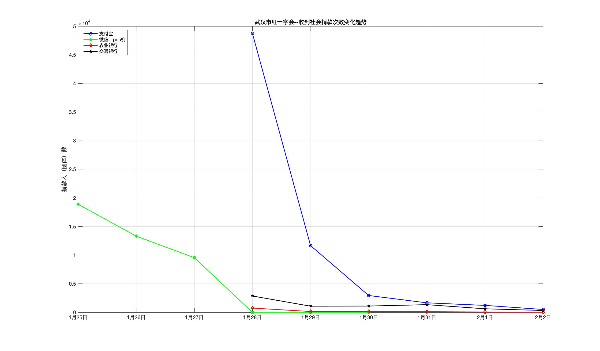
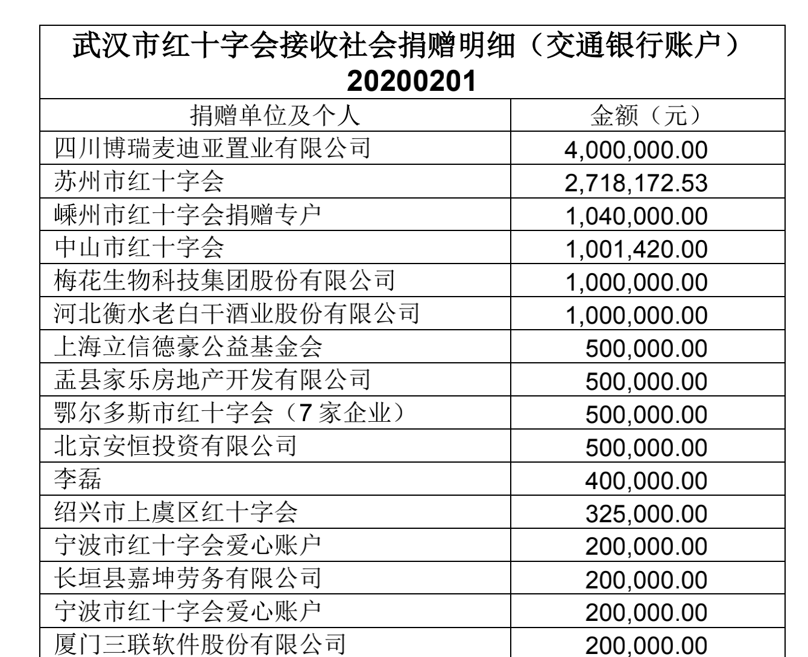
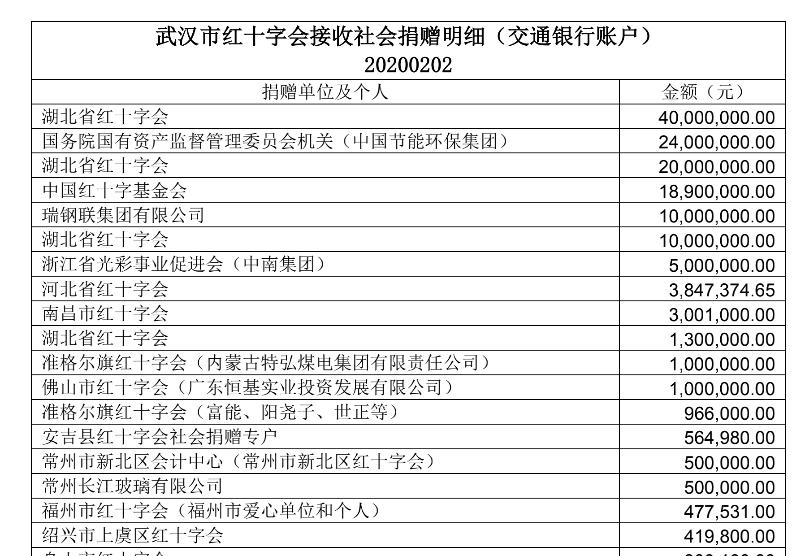
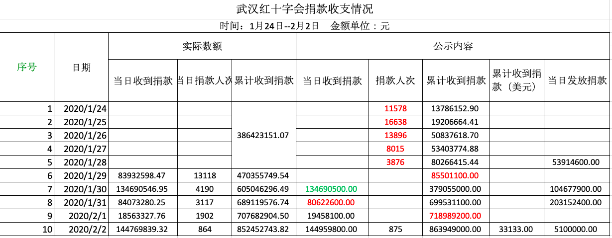



<!-- [给湖北监工](./) -->

## 舆论风波中，武汉红十字还有人捐款吗？
本站深度挖掘了红十字官方公示的数据，一探究竟。

### 武汉市红十字会捐赠收入

蓝色为官方公布捐款累计总额，逐步上升中，并未受到明显影响。红色为官网公布的每日捐款明细的汇总额。奇怪的是这个数目和官网公布的总额并不相等？其中，1月28至30日明细统计总额远高于官网公布总额，好奇官网到底是如何统计的呢？

### 武汉红十字捐款人数变化趋势

虽然捐款总额没有受到影响。但从捐款人数来看，出现了大幅下降。其中微信，支付宝，pos机渠道的捐款人数已经趋向于零。农业银行和交通银行的渠道变化不大。

从捐赠来源来看，（下图为2月1日，2日的捐赠明细），主要捐款都来自政府部门，包括其他地方红十字会等。这些款项数额巨大，且并未收到舆论影响。

总体来看，普通大众已经基本放弃对武汉红十字进行捐款。但疫情期间，国家和其他部门对红十字的支持力度非常大，武汉红十字的收入并没有减少。我们期待红十字将这笔钱用到实处，并能及时公示。我们将继续跟进。

最后，本站不得不再次吐槽一下。目前的官网数据中，有很多自相矛盾的地方。下表是官方公布的总体数据和明细数据的汇总，红色部分是有冲突的地方。

* 1月31日，仅交通银行加农业银行的金额就超过了官方公示的当日收款300万元；
* 28日官方公示了  22日至28日 的数据，此数据现实累计捐款为3.864亿，然而29日公布的累计数只有0.855亿；
* 官方公示的24日至28日累计捐款人次有明显错误，累计数越来越小，而且和事实不符合，故改为捐款人次；
* 29日、30日官方公示的累计数据，应该是算漏了28日以前的捐款，即使这样依然有问题，2月1日的公示就比应该有的累计数额少。"	
* "目前数据最为可信的地方是，每天捐款的人数在明显减少，尤其是支付宝。
* 之后我们会在各个平台进行记名捐款，以验证数据来源的可靠性。"	

[查看具体统计数据](raw_data/summary/武汉红十字会捐款收支情况2.xlsx)

<!-- outdated first data from weilei

### 武汉市红十字会官网统计每日捐赠总额



注： 空白部分数据官网未统计
-->






